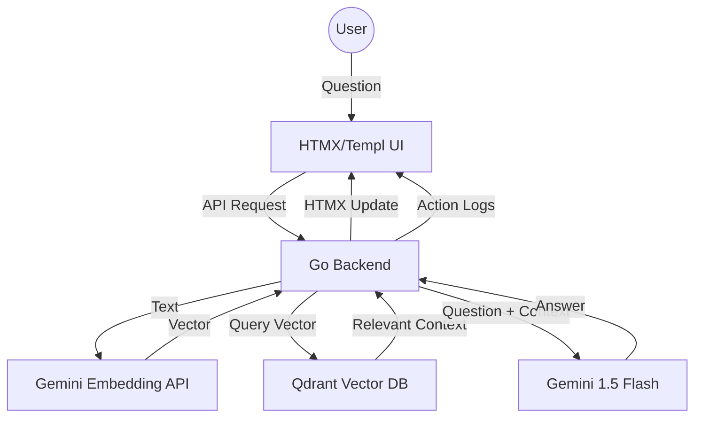

# Qdrant Go POC: Semantic RAG & Vector Search

A high-performance "showoff" project demonstrating the power of **Qdrant**, **Go**, and **Google Gemini** for building Retrieval-Augmented Generation (RAG) systems.

## 🚀 Overview
This application provides a real-time interface to interact with a semantic knowledge base. It uses:
- **Qdrant**: High-performance vector database for similarity search.
- **Go**: Fast, reliable backend using `HTMX` and `Templ` for a modern, reactive UI without complex JS frameworks.
- **Google Gemini**: State-of-the-art embeddings and generative AI for answering questions based on retrieved context.

## 🛠 Architecture


## ✨ Features
- **Semantic RAG**: Ask questions in natural language and get answers based on indexed technical documents.
- **Real-time Action Logs**: Watch every step of the process (Embedding -> Search -> Retrieval -> Generation).
- **Pure Go Stack**: Backend and Frontend are both written in Go, demonstrating high performance and low latency.
- **Automated Seeding**: Automatically creates and seeds a `tech-docs` collection on startup.

## 💡 Vector DB Use Cases
Beyond simple RAG, Qdrant and embeddings enable:
1. **Semantic Search**: Find documents by meaning, not just keywords (e.g., searching "how to quit" finds "termination policy").
2. **Product Recommendations**: Suggest items based on visual or textual similarity + metadata filtering (Price, Brand, Stock).
3. **Anomaly Detection**: Identify outliers in high-dimensional space for fraud detection or system monitoring.
4. **Image & Multimedia Retrieval**: Search through photos, videos, or audio using multimodal embeddings like CLIP.
5. **De-duplication**: Find near-identical entries in massive datasets where exact hash matching fails.

## 🚦 Getting Started

### 1. Prerequisites
- [Docker](https://www.docker.com/)
- [Go 1.25+](https://go.dev/)
- [Google Gemini API Key](https://aistudio.google.com/app/apikey)

### 2. Setup
```bash
# Clone the repository
git clone https://github.com/your-username/qdrant-poc-go
cd qdrant-poc-go

# Set up environment variables
cp .env.example .env
# Edit .env and add your GEMINI_API_KEY
```

### 3. Run
```bash
# Start Qdrant
docker-compose up -d

# Run the Go application
go run cmd/app/main.go
```
Visit `http://localhost:8080` to interact with the dashboard!

## 📸 Screenshots
*(Add your screenshots here after running the app)*

---
Developed as a high-signal POC for modern AI-driven applications.
