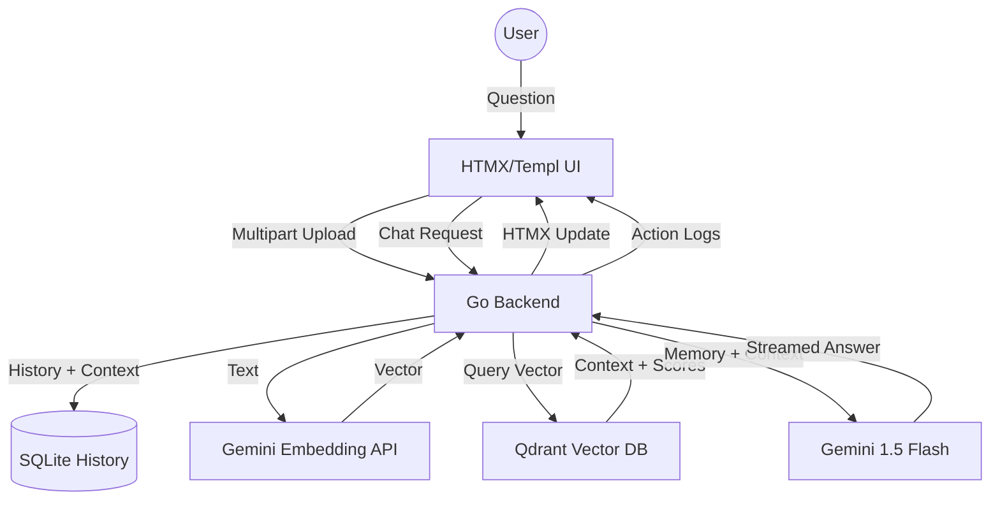

# Qdrant Go POC: Semantic RAG & Vector Search

A high-performance "showoff" project demonstrating the power of **Qdrant**, **Go**, and **Google Gemini** for building production-grade Retrieval-Augmented Generation (RAG) systems.

## 🚀 Overview
This application provides a real-time interface to interact with a semantic knowledge base. It's built for speed, transparency, and persistence, using a modern Go-based stack.

### Core Tech Stack:
- **Qdrant**: High-performance vector database for similarity search and metadata filtering.
- **Google Gemini**: State-of-the-art `text-embedding-004` and `gemini-1.5-flash` for generative RAG.
- **Go + HTMX + Templ**: A "Hypermedia-driven" approach for a reactive UI without the complexity of a JS framework.
- **SQLite**: Local persistence for chat history and metadata.

## 🛠 Architecture


## ✨ Advanced Features
- **Dynamic Knowledge Management**: Upload `.txt` or `.md` files directly via the UI. Files are automatically chunked, embedded, and indexed.
- **Conversational Memory**: The assistant maintains context of the last 5 messages for natural follow-up questions.
- **Streaming Responses**: Real-time character-by-character generation for a responsive user experience.
- **Source Citations**: Every answer includes the original document sources and their similarity scores.
- **Persistent History**: Conversations are saved to a local SQLite database and reloaded on restart.
- **Real-time Observability**: Watch every step of the RAG pipeline (Embedding -> Retrieval -> Generation) in the live "Action Logs".

## 💡 Vector DB Use Cases
Beyond simple RAG, Qdrant and embeddings enable:
1. **Semantic Search**: Find documents by meaning, not just keywords.
2. **Product Recommendations**: Suggest items based on visual or textual similarity.
3. **Anomaly Detection**: Identify outliers in high-dimensional space for fraud or monitoring.
4. **De-duplication**: Find near-identical entries in massive datasets where exact hash matching fails.

## 🚦 Getting Started

### 1. Prerequisites
- [Docker](https://www.docker.com/) & [Docker Compose](https://docs.docker.com/compose/)
- [Google Gemini API Key](https://aistudio.google.com/app/apikey)

### 2. Setup
```bash
# Clone the repository
git clone https://github.com/your-username/qdrant-poc-go
cd qdrant-poc-go

# Set up environment variables
cp .env.example .env
# Edit .env and add your GEMINI_API_KEY
```

### 3. Run with Docker (Recommended)
The entire stack is containerized for easy deployment.
```bash
docker-compose up --build
```

### 4. Local Development
If you prefer running the Go app natively:
```bash
# Start only Qdrant
docker-compose up -d qdrant

# Run the Go application
go run cmd/app/main.go
```
Visit `http://localhost:8080` to interact with the dashboard!

## 📸 Screenshots
*(Add your screenshots here after running the app)*

---
Developed as a high-signal POC for modern AI-driven applications.
